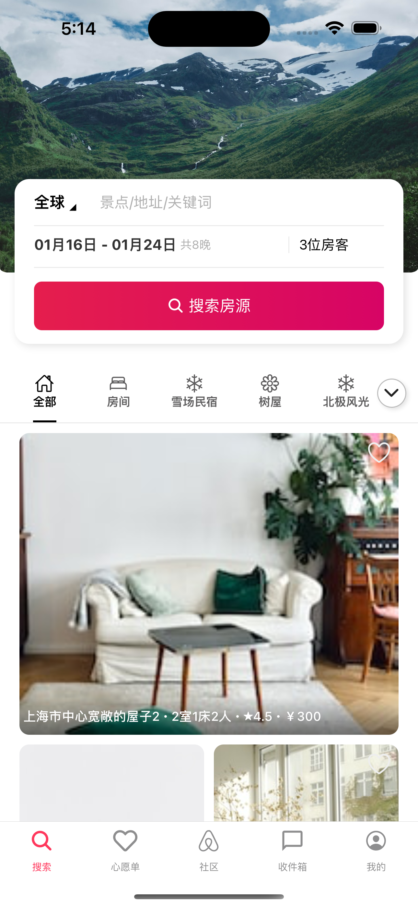
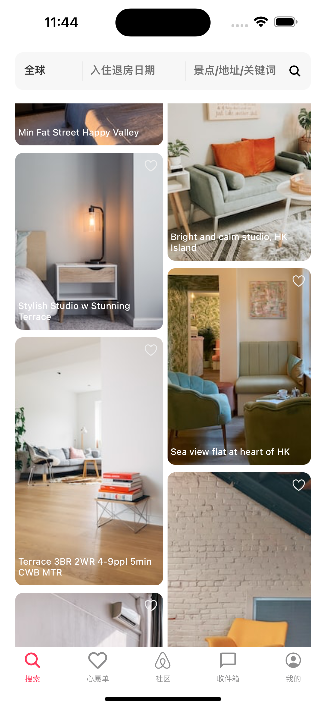
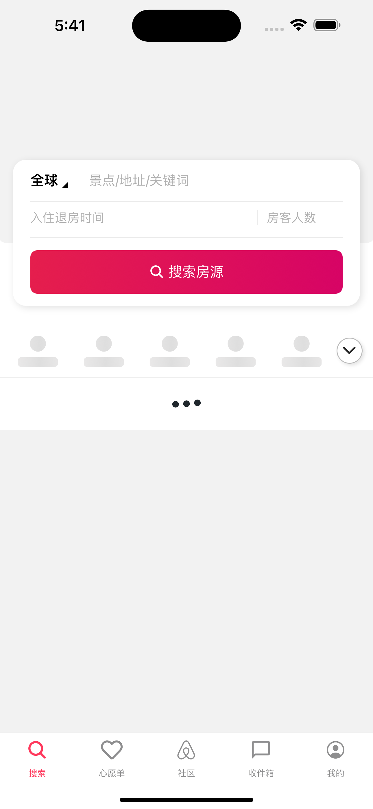
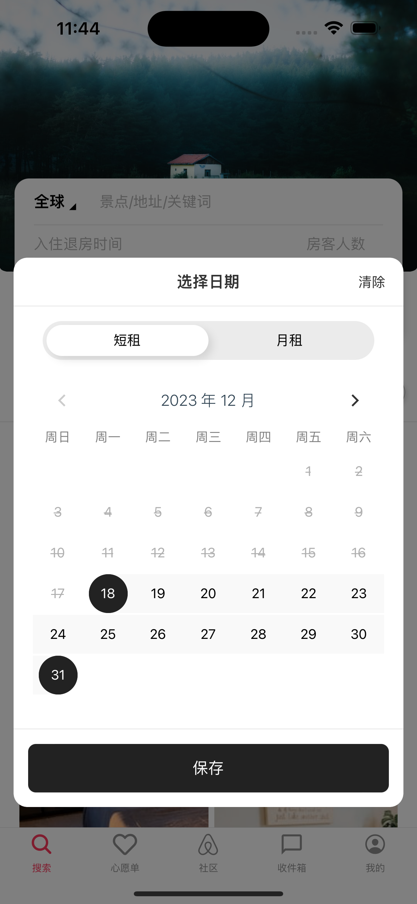
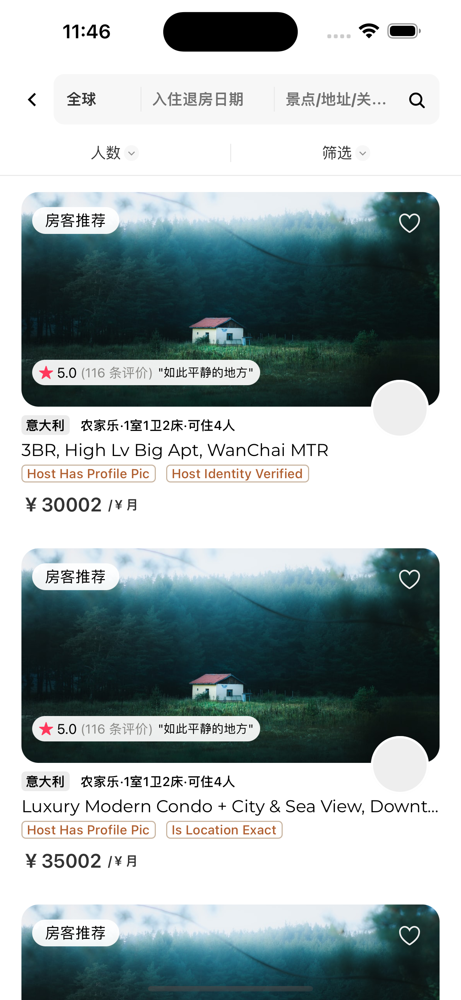
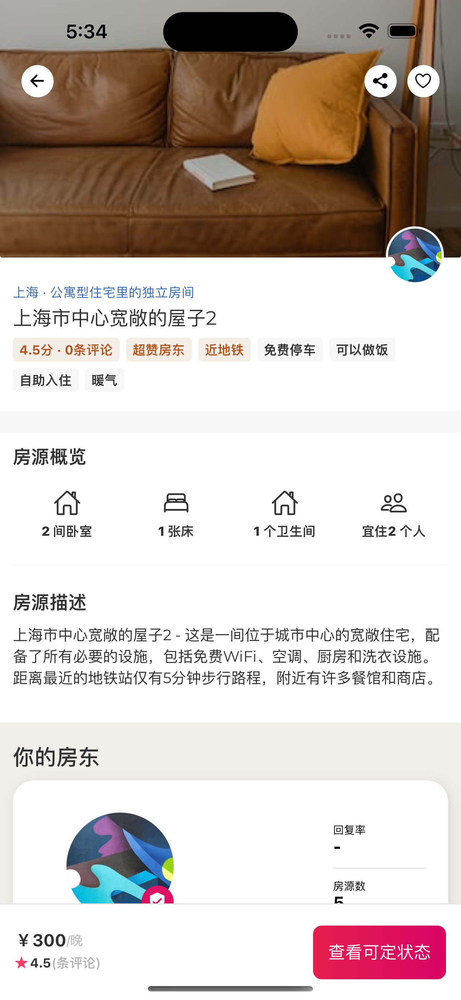
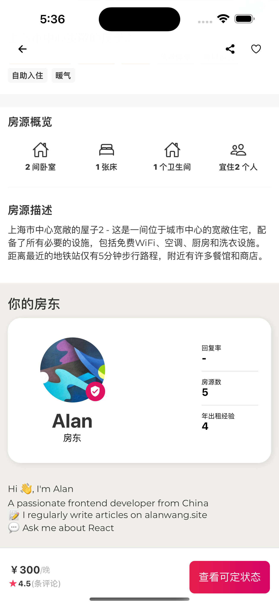

# AriBnb Clone

It is for learning purpose only. All image from unsplash.(https://source.unsplash.com/random)

## Demo

The Demo is read only. You can't create, update or delete any data.

```
Account:
email: alan@test.com
password: 123456
```

### Web

https://trip.alanwang.site/

## Tech Stack

- Expo SDK 50
- Expo Router V3
- Expo API Route
- **MongoDB** for database
- **Zod** for schema validation
- **Prisma** for ORM
- **React Query** for async state management
- **Zustand** for global state management
- **React Hook Form** for form validation

## Screenshots

<div style="display: flex; flex-direction: 'row'; flex-wrap: wrap;">








</div>

## Local Development

### Install Dependencies

```bash
yarn
```

### Set Environment

```bash
mkdir .env
```

```bash
DATABASE_URL="mongodb+srv://<username>:<password>@<cluster-url>/airbnb"
```

### Run MongoDB Replica Set

```bash
docker compose up --wait
```

### Init Database

```bash
npx prisma db push
```

### Start

```bash
yarn start
```
